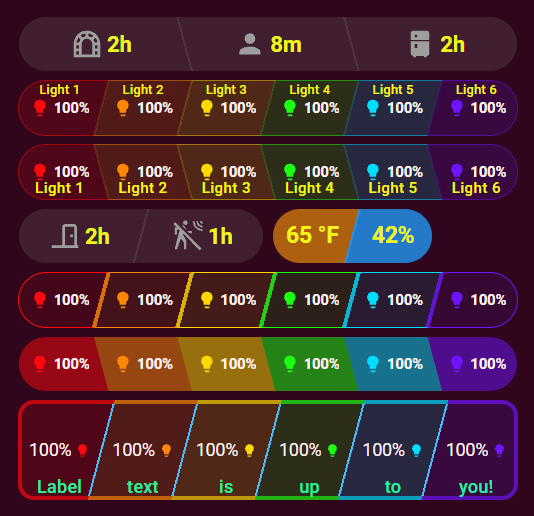

# Segmented Pill — a Bubble Card module for Home Assistant

[](https://ko-fi.com/anigeekapps)
[](LICENSE)

A [Bubble Card](https://github.com/Clooos/Bubble-Card) **module** (`segmented_pill`, creator
**Anigeek**): one rounded pill split into **diagonal** sections, where each section is a Home Assistant
entity — icon + state, with its own entity-derived (or configured) color, tint, labels and borders.



It targets Bubble Card's native **Sub-Buttons-Only** card type: there is no main button, so every segment
is a uniform sub-button and the layout math is generic in **N** — dividers fall at `k/N` for
`k = 1..N-1`, and every color / mode / label / prop is resolved by section index in a loop. Add an Nth
section by adding a sub-button; the pill reads the count. N is **not capped** (6 sections are roomy
full-width on an ultrawide) — the component scales type and labels to the space rather than forcing a
"compact mode."

Per section you get four color modes — **inherit** (default; approximates the entity's HA state color —
see [Color fidelity](#color-fidelity)), **fixed** (a pinned hex), **value** (numeric thresholds → color,
e.g. temp / humidity / brightness), and **active** (a chosen color when the entity is on/active, neutral
grey when off) — plus dynamic tint (fixed or value-driven fill strength), configurable borders/dividers,
top/bottom label slots with optional label templating and transforms, and a configurable icon side (icon
left or right of the text, global default + per-section override).

## Install

**From the Module Store (easiest):** in any card's editor, open **Modules**, find **Segmented Pill**, and
click **Install**. ([Module Store post / discussion →](https://github.com/Clooos/Bubble-Card/discussions/2614))

**Manually (YAML):** copy the `segmented_pill:` module block from
[`bubble-pill-mod.yaml`](bubble-pill-mod.yaml) into your Bubble Card modules — either paste it into
**Module Editor ▸ Import from YAML**, or drop it into a `/config/bubble_card/modules/segmented_pill.yaml`
file. Then reference it from a sub-buttons card with `modules: [segmented_pill]`.

Requires Bubble Card v3.3.0+ and a browser with `color-mix()` and container-query units
(Chromium 111+ / Safari 16.2+ / Firefox 113+).

## Usage

Add the module to a **Sub-Buttons-Only** card; each sub-button under `bottom:` becomes a section. A
three-section example — an inherited-color light, a temperature colored by value, and motion that turns
blue only while detected:

```yaml
type: custom:bubble-card
card_type: sub-buttons
modules:
  - segmented_pill
sub_button:
  bottom:
    - entity: light.island_lights          # section 1 — approximates its HA color
      icon: mdi:lightbulb
      show_state: true
      show_background: false
      scrolling_effect: false
    - entity: sensor.kitchen_temperature    # section 2 — colors by value
      icon: mdi:thermometer
      show_state: true
      show_background: false
      scrolling_effect: false
    - entity: binary_sensor.hallway_motion  # section 3 — blue only while detected
      icon: mdi:motion-sensor
      show_state: false
      show_background: false
      scrolling_effect: false
segmented_pill:
  angle: 105          # ╱  (75 = ╲; 45–135 accepted)
  tint: 16            # default fill strength %
  mode_2: value       # section 2 colors on a low→high scale
  low_2: 65
  high_2: 80
  mode_3: active      # section 3 colored only while active…
  active_color_3: 4a90d9   # …in this blue
  bottom_1: Island    # per-section bottom labels
  bottom_2: Kitchen
  bottom_3: Motion
```

> Sub-buttons want `show_background: false` and `scrolling_effect: false` so the pill's own fill shows
> through. Every knob is also exposed in the module editor; per-card overrides are available via the
> `--pill-*` CSS custom properties in a card's `styles:`.

Section count follows the number of sub-buttons — drop or add one under `bottom:` and the same card
renders 2, 3, 4, … sections with no other change.

### Defaults

1. **Divider color** = the *next* section's color (`divider k` takes section `k+1`'s color).
2. **Value-tint ceiling** of 60% (a value-driven tint never washes the section out completely).
3. **Blank-section palette cycle**: sections with no resolvable color walk
   accent → primary → success → info → warning → error.
4. **Auto type-scale-with-cell-width** is the default (a fixed `scale` / px size is an explicit override).
5. **Editor exposes 6 sections; the code itself is uncapped.**

## Color fidelity

The default (**inherit**) color mode **approximates** what Home Assistant paints for the entity's icon;
it is not a guarantee of exact parity. The module carries a partial port of the HA frontend's
`stateActive()` / `stateColorCss()` logic plus the light `rgb_color` contrast tweak: a color light shows
its `rgb_color`, on/off-style domains resolve HA's `--state-<domain>-…-color` theme variables (so themes
still apply), battery sensors color by level, off/inactive states fall to a neutral grey, and everything
else (plain numeric sensors, …) stays neutral. That covers the everyday cases well.

Known divergences from HA's own `state_color.ts` / `state_active.ts` (each can be pinned explicitly if it
matters to you):

- **weather** — HA colors it; the module leaves it neutral (not in its colored-domain list).
- **camera** — HA treats `streaming` *and* `recording` as active; the module only `streaming`.
- **lawn_mower** — HA is active unless docked/paused; the module is active only for `mowing` / `error`.
- **group** — HA derives the color from the members' domain; the module uses the generic `group` variables.
- **unknown** — HA treats it as inactive; the module uses the *unavailable* color.

If a section's default color matters to you and the entity is one of those, pin it with `color_i`,
`mode_i: active` + `active_color_i`, or `mode_i: value`.

## Development

`gen_yaml.py` is the **source of truth**. It is a Python generator that emits everything from one shared
template so the card form, the module form, and the HTML prototype cannot drift. The module JS logic
lives in the `SHARED` template string; the editor schema and per-section knobs are built around it.

```
python3 gen_yaml.py        # regenerates bubble-pill-mod.yaml + prototype.html
```

The generator takes the **module id as its one optional argument** (it threads through the top-level YAML
key, the code's `this.config[<id>]` read, *and* every editor `visible_if`), so a side-by-side install
under a different id is `python3 gen_yaml.py my_other_id`. **Do not hand-rename just the YAML key** — the
id must thread through the code's config read too, which is exactly what passing it as the generator
argument does. `prototype.html` is a standalone replica of Bubble's sub-buttons-card DOM running the exact
module code against a fake `hass`, for quick visual iteration; `preview.png` is a headless-Chromium render
(dark + light) of the demo rows.

Building on this, or writing your own Bubble Card module? The reverse-engineered Bubble Card internals
that shaped this one (sibling-DOM structure, the editor auto-rows loop, `visible_if`/`ha-form`, and more)
are collected in [`docs/bubble-card-internals.md`](docs/bubble-card-internals.md).

## Support

If this saved you some time, [a coffee on Ko-fi](https://ko-fi.com/anigeekapps) is always appreciated. 🦞

## License

MIT — see [LICENSE](LICENSE). Bubble Card itself is © Clooos, MIT-licensed, and is not redistributed here.
